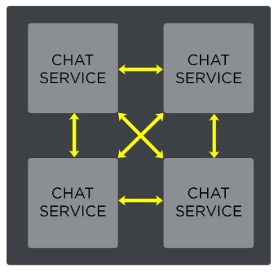

Extensible Messaging and Presense Protocol - communication protocol based on xml.
GTalk used XMPP for instant messaging and as a base for a voice and file transfer signalling protocol called Jingle. Video also uses Jingle.

**Decentralization**: Anyone can run their own XMPP server and there is no central master node
**Security**: servers can be isolated and secure authentication (SASL) and encryption (TSL) have been built into the core XMPP spec
**Flexibilty**: can build custom functionality on top of XMPP.

XMPP network uses a client-server architecture. Anyone can run a server. You can also connect to public XMPP server run at jabber.org, to which a large number of users subscribe
Every user has a JID (jabber id) in the same format as email
log in from multiple locations: `user@example.com/mobile`, where `mobile` is a resource, which can have a priority, so sending something to `user@example.com` will go to the resource with the highest priority, but if you send to `user@example.com/mobile` - will go to mobile only
XMPP is well-suited for service discovery due to presence information?
XMPP's native transport protocol is TCP (Transmission Control Protocol) using XML streams over long-lived TCP connection.
Community developed an HTTP transport for web clients and for strict firewalls (HTTP is firewall-friendly).
Websocket protocol is the most efficient probably
Long polling vs short polling: the upper bar is client, the bottom - server


**ejabberd** is Erlang-based XMPP server

# Riotgames blog

## XMPP
why not P2P:
  - exposes other client's IP
  - risk of spoofing attack
  - no validation (rate limits?)
  
Store history of chat?

- XMPP has a built-in presence mechanism
- supports 1:1 messaging, group chats, offline messaging

in order to broadcast availability to friends, the client sends:
```xml
<presence type=’available’/>
```
To ask the server to fetch a full friends list:
```xml
<iq type=’get’ id=’roster1234’>
 <query xmlns=’jabber:iq:roster’/>
</iq>
```
To message a friend:
```xml
<message to=’sum1234@pvp.net’>
  <body>Hey there, wanna play?</body>
</message>
```

You can add additional tags (such as `<note>` tag for the contacts)

Ignore list in default implementation: you have to transmit the entire list back and forth. But you could have your own extension that allows to add and delete by a single item

## Servers
Chat are distributed between clusters. Users in different clusters cannot communicate.
Load balancer balances the load between identical hosts
Use Erlang for XMPP server implementation
Form a fully connected cluster where each Erlang VM maintains a single persistent TCP connection to each other chat server.



Servers also share a fully replicated internal tables via Erlang-distributed store called Mnesia. These tables map player or group JIDs to Erlang **session handler processes** that maintain context-specific data.
For individuals: includes connection socket, friends list, block list, rate limiters;
For groups chats: room roaster and chat history.
Each server has the full data - so it is fully replicated
Once connection is established - a dedicated Erlang process is created to handle the session.
Authentication is performed using SASL
- Alice’s AIR client sends an XMPP message (carrying “do you wanna build a duo bot death squad?” payload) to the chat server over the secure TCP connection maintained in Alice’s c2s process.
- Alice’s c2s process receives the message, decrypts it, and parses the XML.
- After parsing, the process applies a number of validations on the message including rate limit compliance, spoof checking, and membership tests of the ignore list and friends list.
- After passing these validations, Alice’s c2s process looks up Bob’s session handler in the internal routing table to validate his availability.
- If Bob is currently unavailable, the message sits in the persistent data store for delivery until he next logs into the game. Depending on the shard this store is either MySQL (for legacy environments) or Riak (for new shards). Data stores will be the topic of my next blog post on chat.
- If, however, Bob is available, the server sends the message to his c2s process using standard Erlang message passing mechanisms.
- When Bob’s c2s process receives the message, it applies a number of validation tests similar to those of the sender.
- The process then serializes the message into XML and sends it to Bob’s TCP socket.
- Finally, Bob’s AIR client receives the message and displays it in the appropriate chat window.

Read about [BOSH](https://en.wikipedia.org/wiki/BOSH_(protocol)) and [Jingle](https://en.wikipedia.org/wiki/Jingle_(protocol)) protocols
