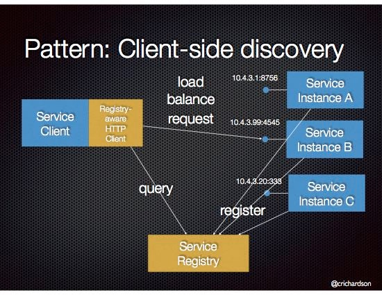
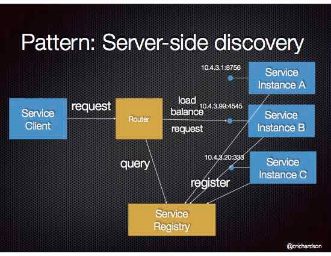
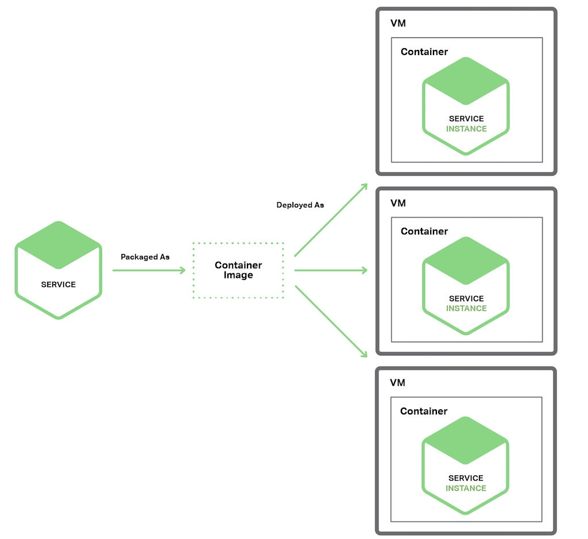
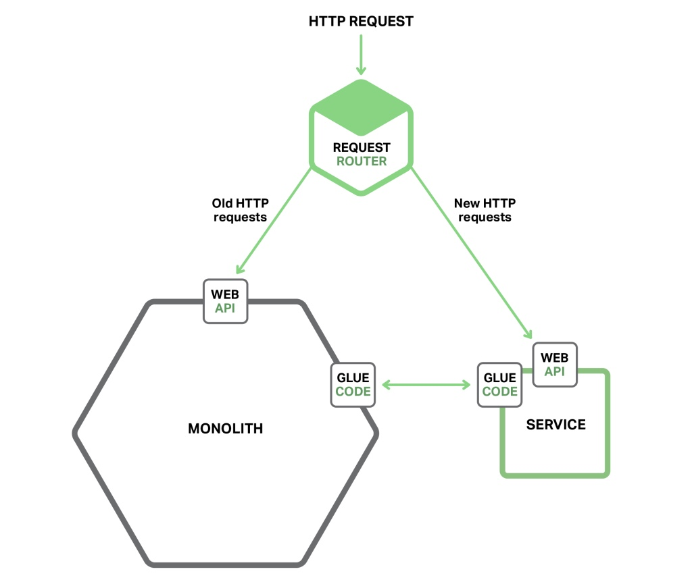

# Part 1. Introduction to microservices
Having a separate datastore by microservices has significant implications
continuous deployment/intergration? What is it?
What is agile development?

## Problems of monolithic apps
When monolithic app grows too big - it gets hard for a single developer to fully understand.
The larger the app - the longer the start-up time is.
Prevents continuous deployment: pusing changes into prod many times a day - you have to redeploy the entire app
Can be difficult to scale if different modules have different requirements: one needs a lot of CPU for computations, another - a lot of memory.
Reliability issues: bug in one module impacts the entire app.
Extremely difficult to adopt new frameworks and languages.

## Microservices - tackling the complexity
Each microservice is a mini-app that has its own hexagonal architecture, consisting of business logic along with various adapters. Some microservices would expose an **API that's consumed by other microservices or app's clients**, others might **implement a web UI**. Each instance is either a VM or a Docker container.

Each backend service exposes a REST API (REST stands for **Representational state transfer**, API stands for **Application Program Interface**)

Mobile apps don't communicate with the backend: instead they communicate through an API Gateway.

The Art of Scalability book: The "Scale Cube": X axis - horizontal duplication (scale by cloning), Y axis - functional decomposition (scale by splitting different things, that's what microservices do), Z axis - data partitioning (scale by splitting similar things), where an attribute of the request (for instance, the primary key of a row or identity of a customer) is used to route the request to a particular server.

Microservice can be scaled horizontally: multiple docker containers behind a load balancer (NGINX is also a load balancer!)

Each app has it's own schema. It often results in duplication of some data, however - **separate database/schema it is essential to ensure loose coupling**.

Different of microservices from SOA: it avoids web service specifications (WSDL, SOAP, ...), rejects the concept of a canonical schema (preserving data model, like table must have same schema?).

### Benefits of microservices

- avoids complexity as it decomposes the app
- each service has a well-defined boundary, in the form of RPC or API
- enforces a level of modularity
- individual services are much faster to develop, and much easier to understand and maintain
- each service is developed independently by a team
- developers can choose any technology, provided that the service honors the API contract
- each microservice is deployed independently; UI team could more affectively perform A/B testing and rapidly iterate on UI changes
- scaled independently, on different hardware

### Drawbacks of microservices
- developers tend to build extremely fine-grained services (thinking that the name implies)
- inter-process communication - we're in a distributed system now
- partitioned db architecture is a challange. Business transactions that update multiple business entities are fairly common. Distributed transactions are not supported by many DBMS, so you end up having to use an eventually consistent approach.
- testing is more complex: a test class for a service would need to launch that service and any services that it depends upon, or at least configure stubs for them
- implementing changes that span across multiple services is challenging: rollout of changes have to be carefully coordinated.
- requires a service discovery mechanism

# Part 2. API Gateway
You need to decide how application's clients will interact with the microservices.
Displaying Amazon product information on a mobile app:
- Shopping Cart Service – Number of items in the shopping cart
- Order Service – Order history
- CatalogService–Basicproductinformation,suchasproductname,image,andprice
- ReviewService–Customerreviews
- Inventory Service – Low inventory warning
- Shipping Service – Shipping options, deadlines, and costs, drawn separately from the
shipping provider’s API
- Recommendation Service(s) – Suggested items

## Option 1. Direct Client-to-Microservice Communication
each MS has a public endpoint (URL of the load balancer), and client makes 7 requests. Drawbacks:
- mismatch between the needs of the client and the fine-grained APIs exposed by each of the microservices.
- for instance, Amazon has hundres of services involved in rendering product page
- mobile network is expensive
- client code is much more complex
- some MSs could use not a friendly protocols: Avro RPC, AMQP message protocol, etc.
- hard to refactor microservices: might merge services, or split into 2 - then client needs to be refactored.

## Option 2. API Gateway
API gateway is a server that is the **single entry point into the system** (similar to Facade pattern). API Gateway could have other responsibilities:
- authentication
- monitoring
- load balancing
- caching

As a result, the API Gateway can provide client with a custom API: /productdetails?id=xxx.
Netflix failed to provide a on-size-fits-all API for their streaming service - but there is a diverse range of devices and their unique needs. So now they use an API Gateway that provides an API tailored for each device by running device-specific adapter code. Netflix API Gateway handles billions of requests per day.

### Benefits of API Gateway
- encapsulates internal structure of the application
- can provide each kind of client with a specific API.

### Drawbacks
- it's another highly available component that must be developed, deployed, and managed.
- there is a risk it will become a development bottleneck: developers must update the API gateway
- process to update the API gateway must be lightweight, otherwise developers will be waiting in line for updates

## Implementing an API Gateway

### Performance and scalability
Makes sense to build it on a platform supporting asynchronous, non-blocking I/O (Netty, Vertx, Spring Reactor), Node.js, NGINX Plus
### Using a Reactive Programming Model
In most cases, requests to MSs should be done concurrently. Sometimes, there are dependencies between requests to MSs: it might call Auth Service first before routing request. Another example: wishlist, we first need to fetch profile information (has product ids of wishilist), then for each product fetch information.
Reactive approach is more readable and better approach than having a callback hell. Scala has Future, Node.JS can use RxJS, which enable writing simple yet efficient API gateway code.

### Service invocation
two styles of communication:
- asynchronous: messaging-based mechanism (AMQP broker, etc.), Zeromq - brokerless, directly
- synchronous: HTTP, Thrift

API Gateway needs to support a variety of communication mechanisms.

### Service discovery
API Gateway needs to know location of each MS it will communicate with. API Gateway needs to use the system's service discovery mechanism: either server-side discovery, or client-side discovery.

### Handling partial failures
Cannot wait for the underlying service forever: need to handle failure. **Handling failures depends on a scenario**: in case of product info, if recommendation is broken - API Gateway should return the rest of the info anyway. But if product information service is broken - API Gateway should return an error. API Gateway could also return cached data if available.

[Netflix Hystrix](https://github.com/Netflix/Hystrix) - library for writing code that invokes remote services. Implements _circuit breaker pattern_. If error rate for service exceeds a threshold, it all requests will fail fast for a specific period of time. Lets you define a fallback action (calling cache, returning default value). JVM-based.

# Part 3. Inter-processes communication
Interactions can be one-to-one or one-to-many (request is processed by multiple services).
Interactions can be synchrous - client expects a timely response and might even block waiting, async - doesn't block while waiting.
One-to-one interactions:
- Request/response–Aclientmakesarequesttoaserviceandwaitsforaresponse. The client expects the response to arrive in a timely fashion. In a thread-based application, the thread that makes the request might even block while waiting
- Notifcation (a.k.a. a one-way request) – A client sends a request to a service but no reply is expected or sent
- Request/async response – A client sends a request to a service, which replies asynchronously The client does not block while waiting and is designed with the assumption that the response might not arrive for a while.
One-to-many interactions, both **async**:
- Publish/subscribe – A client publishes a noti cation message, which is consumed by zero or more interested services
- Publish/async responses – A client publishes a request message, and then waits a certain amount of time for responses from interested services.

## Defining APIs
It's important to precisely define APIs. Development of service begins with writing interface definition and reviewing it with client developers.

## Evolving APIs
How you handle API changes depends on the size of the changes. It's good to make it backwards compatible. For larger changes, service must support older version for some period of time. **Tip**: if an HTTP API: embed version number into the url (/v1/..., /v2/...).

## Handling partial failure
Strategies for dealing with partial failures:
- network timeouts - never block indefinitely
- limiting outstanding requests - if limit is reached, it means system chokes, so requests can fail immediately
- circuit breaker pattern - track # of successful and failed requests, trip requests after threshold
- provide fallback - cache, ...

## Asynchronous, message-based communication
Client is written not to expect response immediately. Actually if service is expected to reply, it sends a separate message.
A "message" consists of headers (metadata, such as the sender) and body. Messages are exchaged over channels. Any number of producers can send messages to a channel, and any number of consumers. Channels can be **point-to-point** (delivered to exact consumer), and **publish-subscribe** (multiple consumers can subscribe).
Advantages:
- client doesn't need to know about services (so no service discovery needed) - just sends data to channel
- message buffering, things get queued, other services don't wait
- it's IPC, so developers understand that it's not like calling a local service, understand the risks
Disadvantages:
- additional operational complexity - another system component
- more complex to implement request/response interaction (each request must have reply channel id and a correlation id)

## Synchronous, Request/Response IPC
### REST
almost always uses HTTP. Key concept - resource - which represents a business object (product, customer) or a collection of such.
Advantages of HTTP:
- simple and familiar
- easy to test via browser and curl
- direct support for request/response
- firewall friendly
- doesn't require a broker
Disadvantages:
- only for request/response: even if send notification, service always returns a response
- direct communication: both client and service need to be up
- service discovery is needed
## Thrift
Framework for writing cross-language RPC cleints and services. You define your APIs, compiler generates client-side stubs and server-side skeletons. Works with c++, java, python, php, ruby, nodejs.
Thrift interface consists of one or more services, where service definition is like java interface.
Thrift supports JSON, binary, and compact binary formats. Binary is faster to decode.
Gives you choice of transport protocols: raw TCP(more efficient) or HTTP (firewall and browser friendly).

## Message formats
Important to pick right message format: in the future you might have more languages/frameworks.
Two kinds:
- text (JSON and XML). Disadvantage: verbose, parsing is expensive
- binary: Protocol Buffer and Avro

# Part 4. Service Discovery
Service instances have dynamically assigned IPs + the set of service instances changes dynamically (auto scaling).
## Client-side discovery pattern
Client is responsible for detecting location and load balancing requests. First queries service registry (database of available service instances), then uses a load-balancing algorithm.

Client-side discovery ([Netflix Ribbon](https://github.com/Netflix/ribbon/wiki) is used as a load balancer (has multiple load balancing techniques), [Netflix Eureka](https://github.com/Netflix/eureka) used for service discovery):

Service instances are registered with it starts up, removed when terminated. Heartbeat mechanism.
Example: 
1. Netflix Eureka is a service registry - API for managing registration and queries available instances.
2. Netflix Ribbon - IPC client that load balances requests.

### Benefits
- no moving parts, except for service registry
- app-specific, smart load-balancing decision, such as consistent hashing(**READ!!!**)
### Drawbacks
- couples client with service registry - service discovery logic must be implemented for each client

## Server-side discovery pattern

Server-side discovery:

Lifecycle:
1. client makes request to a service via load balancer
2. LB queries service registry and routes each request to an available service instance
Service instances are registered/deregistered with the service registry

AWS ELB if used to load balance that is in VPC:
1. client makes request to ELB
2. ELB load balances traffic EC2 instances or ECS (EC2 Container Services)
3. No need for a separate service registry - instead, instances are registered with ELB

## Service registry
Needs to be highly available and up to date. Service registry consists of a cluster of servers that use replication protocol to maintain consistency.

Netflix Eureka: service instance registers its network location using a POST request. Every 30 seconds it must refresh its registration using a PUT request. Instance removed either by DELETE request, or by registartion timing out.
Eureka achieves high availability by running 1+ servers in each Amazon EC2 availability zone.
DNS TEXT records store mapping of AZ to network locations. When a new server starts, it queries DNS to retrieve cluster configuration, locates peers and assigns an unused Elastic IP address (With an Elastic IP address, you can mask the failure of an instance or software by rapidly remapping the address to another instance in your account)
Eureka clients - services and service clients - query DNS to discover network locations of Eureka servers (usually in same AZ).

Kubernetes and AWS do not have an explicit service registry - instead it's a built-in part of the infrastructure.

## Service registration options
1. register themselves
2. let other components manage registration of serviecs

### Self-registration pattern
Instance itself is responsible + sends heartbeats.
Benefits: simplicity
Drawbacks: couples instances with service registry, so need to implement registration code in each PL and framework

### Third-party registration pattern
A _service registrar_ handles registration, tracks changes to the set of running instances by polling deployment environment or subscribing to events. When notices new instances - registers with service registry, also unregisters terminated instances.

Example: [Registrator](https://github.com/gliderlabs/registrator) project - automatically registers and deregisters services for any Docker container by inspecting containers as they come online. Works with Consul, etcd, SkyDNS 2.

Benefits: decouples services from Service Registry.
Drawbacks: another highly available component.

# Part 5. Event-Drive Data Management for Microservices
Monolith can use ACID transactions:
- Atomicity – Changes are made atomically
- Consistency – The state of the database is always consistent
- Isolation – Even though transactions are executed concurrently, it appears they
are executed serially
- Durability – Once a transaction has committed, it is not undone
SQL planner helps to execute queries affectively.
Different microservices often use different kinds of DB. Example: service that stores and queries text can use Elasticsearch. Service that stores social graph data should use a graph database, such as Neo4j. Some use multiple databases.

Challenge 1. How to implement business transactions, consistent across multiple services. Distributed transactions (2-phase commits) are usually not a viable option.
Challenge 2. How to write queries that retrieve data from multiple data stores.

## Event-driven architecture
Microservice publishes event when updates a business entity. Others subscribe to those events. When consumer receives an event, it can update its own business entities, which might lead to more events published.

Example with order-credit reservation:
1. Order Service creates and order with status NEW, publishes ORDER CREATED event
2. Customer Service consumes the event, reserves a credit, and publishes CREDIT RESERVED event
3. Order service consumes the event, changes status to OPEN

Requirements for the approach:
- each service must automatically update DB and publish an event
- message broker guarantees AT_LEAST_ONE delivery

Important: **no ACID, it's eventually consistent system**.

We could also create a separate MS that stores pre-joined data (materialized views): Customer Order View Updater Service consumes events from order service and customer service, and update its data store. Customer Order View Query Service queries the data store. The datastore could be mongoDB, where each document represents a customer.

Pros: transactions spanned across multiple services, maintains materialized views.
Cons: more complex programming model, dealing with inconsistent/stale data, handling duplicate events.

## Achieving atomicity
What if service crushes after updating the DB, but before publishing the event - we'll end up with inconsistent data. So these 2 operations must be atomic.

Multi-step process involving local transactions:
- have additional table - EVENT
- order service updates entities, and inserts record into EVENT table with status NEW
- separate thread or process looks at EVENT table periodically, publishes events with status NEW, and updates their status to PUBLISHED

Benefits: guarantees that event is published at least once
Drawbacks: developer must remember to publish events + some data stores have limited transaction and query capabilities.

## Mining database transaction log
Example: [LinkedIn databus](https://github.com/linkedin/databus). Another approach: introduce Transaction Log Miner thread/process that reads from Transaction Log of the database and publishes events. It avoids 2-phase commit, can simplify app by separating event publishing from app's business logic. The problem is that transaction logs are different depending on datastore. Also they are at a low level, and hard to reverse-engineer the high-level business logic.

## Using event sourcing
Rather than store current state of entity, the changes to the entity are stored in the Event Store, and application reconstructs current state by replaying the events. Whenever the state of a business entity changes, new event is appended. Since saving an event is a single operation - it is atomic.
Event Store provides API that enables services to subscribe to events - it delivers it to all interested.
Benefits: reliable publishing events whenever state changes, 100% reliable audit log of changes - we can restore state at any point of time, loosely coupled business entities that exchange events.
Drawbacks: learning curve, as it is a new style of programming. Eventual consistency
See more examples [here](https://github.com/cer/event-sourcing-examples/wiki)

# Part 6. Choosing Microservices Deployment Strategy

## Multiple service instances per Host pattern
one or more hosts/VMs running multiple service instances on it. 
One variant is for each service instance to be a process or a process group. Example: java service instance on Tomcat.
Other variant: run multiple service instances in the same process or process group. Example: multiple web apps on the same Tomcat server.

Benefits:
- resource usage is efficient
- deploying a service instance is fast: simply copy WAR file
Drawbacks:
- little or no isolation of the service instances (unless each is running as a separate process)
- cannot limit resource consumption of each instance: one instance could eat all CPU or memory
- in the same process (Tomcat): means sharing JVM heap
- ops team need to know how to deploy app: there are many PLs and frameworks
- overall, one can impact liveness of another

## Service instance per host pattern
### Service instance per Virtual Machine pattern
Each service is packaged as a virtual machine image (like AMI), and each service instance is a VM (example: EC2 instance) that is launched using that VM image.
Netflix uses this approach.

There are more lightweight VMs, such as [Boxfuse](https://boxfuse.com/) - about 50MB files, can deploy either VurtialBox, or convert it to AMI and launch on EC2. Super fast.

Benefits: each instance runs in complete isolation, has fixed amount of CPU and memory. You can incorporate load balancing and autoscaling provided by AWS. Once VM is ready, the service implementation is a black box.

Drawbacks: less efficient resource utilization. Each service has an overhead of an entire VM and operating system. Creating a new VM is slow, and instantiating it is also slow (not true for Boxfuse)

## Service instance per container pattern
Each service instance runs in its own container. Containers are a virtualization mechanism at the operating system level. Consists of one or more processes running in a sandbox. They have **their own port namespaces and root filesystem**. You can limit container's memory and CPU resources, and some of the implementations also have I/O rate limiting. Example: Docker.

Some container images consist of a complete Linux root filesystem. Others, like Java apps, can contain an apache tomcat server and compiled java app.

Benefits - almost same as VM per instance:
- lightweight, unlike VPM
- containers start quickly - there is no OS boot
- Ec2 Container Service (ECS) helps managing deployment of multiple apps to a cluster of EC2 instances and backed by Docker.

Drawbacks:
- not as secure as VMs, since containers share the kernel of the host OS with one another
- You might pay more than you need, as you don't utilize fully all the VM resources

## Serverless deployment
AWS Lambda is a example, supports java, nodejs, and python. To deploy a microservice: you package it as a zip file and metadata about which function is invoked to handle a request, and upload it to Lambda. AWS Lambda automatically runs enough instances of your microservice to handle the requests - you're billed on the time taken and the memory consumed per request.

Microservices need to be stateless - Lambda can create new instances.

4 ways to invoke Lambda:
- directly, using a web service request
- automatically, in response to an even generated by an AWS service (S3, Kinesis, DynamoDB, SES)
- automaticall, via AWS API Gateway to handle HTTP requests
- periodically, according toa  cron-like schedule

Benefits: 
- cost efficient
- no responsibility for the IT infrastructure
Drawbacks: 
- long-running services cannot use it, requests must complete within 5 minutes
- services must start quickly - otherwise they might be timed out and terminated

# Part 7. Refactoring a Monolith into Microservices

Don't use "Big Bang" rewrite from scratch, instead - incrementally rewrite monolith into microservices.
## Strategy #1 - Stop digging
In other words - stop making monolith bigger. New functionality should go into separate microservice.

Legacy requests are routed to Monolith, new requests - to the new MS. Glue code is responsible for data integration.

Strategies for MS to access the monolith's data:
- invoke API provided by monolith
- access monolith's DB directly
- maintain its own copy of data, synced with monolith's DB

## Stretegy #2 - Split frontend and backend
Split presentation layer from business logic and data layers. There is usually a clean separation between the presentation logic on one side and the business and data-access logic on the other side. After the split, the presentation logic makes remote calls to the business logic app. After that, the two components can iterate separately: UI designers can A/B test more frequently, etc.

### Strategy #3 - Extract services
Turn existing modules into standalone microservices. Eventually, monolith either disappears entirely, or shrink into another microservice.

Need to prioritize which modules to convert into services. Usually beneficial to convert frequently changing modules. Same true for module that require resources different from the rest of monolith. Same is for computationally expensive algos.
Two-step approch for extracting a module:
1. define interface between the module and the monolith (most likely bi-directional API)
2. turn module into a free-standing service by writing code that allows monolith and the service to communicate
