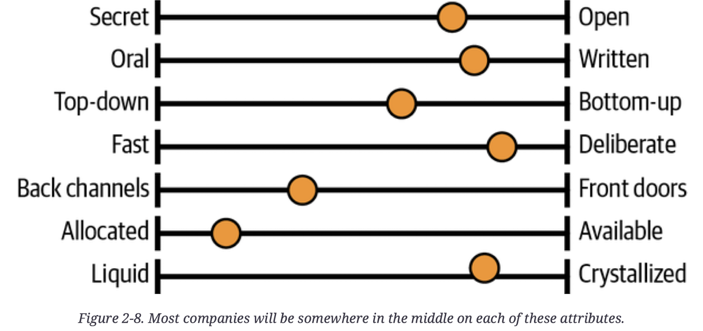
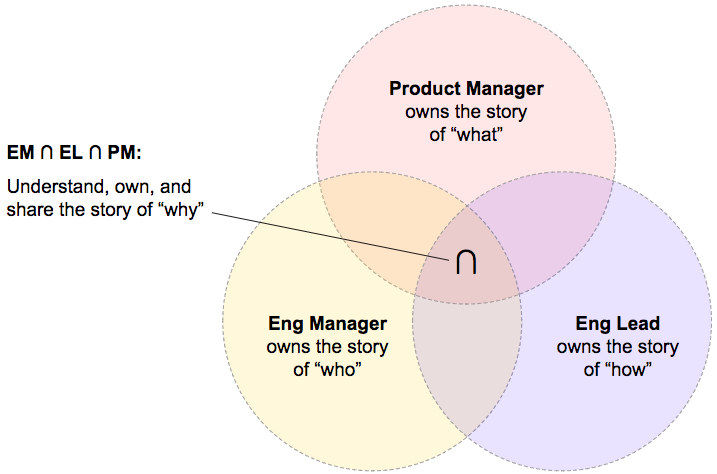

- [Chapter 2. Three maps](#chapter-2-three-maps)
  * [Locator map](#locator-map)
  * [Seeing Bigger](#seeing-bigger)
    + [Taking the outside view](#taking-the-outside-view)
    + [Escaping the echo chambers](#escaping-the-echo-chambers)
    + [What's actually important](#whats-actually-important)
    + [What do customers care about?](#what-do-customers-care-about)
    + [Have your problems been solved before?](#have-your-problems-been-solved-before)
  * [Topographical map](#topographical-map)
    + [Understanding your org's culture](#understanding-your-orgs-culture)
      - [Secret or open?](#secret-or-open)
      - [Oral or written?](#oral-or-written)
      - [Top-down or bottom up?](#top-down-or-bottom-up)
      - [Back channels or front doors?](#back-channels-or-front-doors)
      - [Allocated or available?](#allocated-or-available)
      - [Liquid or crystallized?](#liquid-or-crystallized)
    + [Power, rules, or mission?](#power-rules-or-mission)
    + [Points of interest on the topo map](#points-of-interest-on-the-topo-map)
      - [Fortresses](#fortresses)
      - [Disputed territory](#disputed-territory)
      - [Uncrossable deserts](#uncrossable-deserts)
      - [Paved roads, shortcuts, and long ways around](#paved-roads-shortcuts-and-long-ways-around)
    + [What points of interest are on your map?](#what-points-of-interest-are-on-your-map)
      - [How are decisions made?](#how-are-decisions-made)
      - [Where is the room?](#where-is-the-room)
      - [Asking to join in](#asking-to-join-in)
      - [The shadow org chart](#the-shadow-org-chart)
    + [Keeping your topo map up to date](#keeping-your-topo-map-up-to-date)
  * [If the terrain is still difficult to navigate, be a bridge](#if-the-terrain-is-still-difficult-to-navigate-be-a-bridge)
  * [Treasure map](#treasure-map)
- [Chapter 5. Leading Big Projects](#chapter-5-leading-big-projects)
  * [The Start of a Project](#the-start-of-a-project)
  * [Building Context](#building-context)
  * [Giving your project structure](#giving-your-project-structure)
    + [Defining roles](#defining-roles)
    + [Rercruiting people](#rercruiting-people)
    + [Agreeing on scope](#agreeing-on-scope)
    + [Estimating time](#estimating-time)
    + [Agreeing on logistics](#agreeing-on-logistics)
    + [Having a kickoff meeting](#having-a-kickoff-meeting)
  * [Driving the project](#driving-the-project)
    + [Exploring](#exploring)
    + [Important aspects of the project](#important-aspects-of-the-project)
    + [Possible approaches to take](#possible-approaches-to-take)
    + [Clarifying](#clarifying)
    + [Mental models](#mental-models)
    + [Naming](#naming)
    + [Pictures and graphs](#pictures-and-graphs)
  * [Designing. What goes in an RFC?](#designing-what-goes-in-an-rfc)
    + [Context](#context)
    + [Goals (or justfication)](#goals-or-justfication)
    + [Design](#design)
    + [Security/privacy/compliance](#securityprivacycompliance)
    + [Alternatives considered/prior art](#alternatives-consideredprior-art)
    + [Tradeoffs](#tradeoffs)
    + [Risks](#risks)
    + [Dependencies](#dependencies)
    + [Operations](#operations)
  * [Technical pitfalls](#technical-pitfalls)
    + [This looks easy](#this-looks-easy)
    + [Building for the present](#building-for-the-present)
    + [Building for distant, distant future](#building-for-distant-distant-future)
    + [Every user just needs to...](#every-user-just-needs-to)
    + [We'll figure out the difficult part later](#well-figure-out-the-difficult-part-later)
    + [Solving the small problem by making the big problem more difficult](#solving-the-small-problem-by-making-the-big-problem-more-difficult)
    + [But is it operable?](#but-is-it-operable)
    + [Dicussing the smallest decisions the most](#dicussing-the-smallest-decisions-the-most)
  * [Coding](#coding)
    + [Should you code on the project?](#should-you-code-on-the-project)
    + [Be an examplar, but not a bottleneck](#be-an-examplar-but-not-a-bottleneck)
  * [Communicating](#communicating)
    + [Talking to each other](#talking-to-each-other)
    + [Sharing status](#sharing-status)
    + [Navigating](#navigating)

# Chapter 2. Three maps

Locator map - where you are at.

Topographical map - terrain and obstacles map.

Treasure map - X marks of where the treasure is (could be milestones of a project).

These three maps already exist, they are just obscured. As you build context, you'll uncover everyone's goals. Think of it like a fog of war in a video game, where you can't see what awaits you in the parts of the map you haven't explored yet. As you scout around, you clear the fog and get a better picture of the terrain.

If you can train your brain to say "That's interesting!" and remember facts that you might need later on, you'll start to add detail to your maps and build skills in synthesizing new information.

Think of gathering context as a skill to build as part of your job.

## Locator map

As you undestand people, the problems, and the goals, you'll become more focused on them. That focus brings depth and understanding, but it comes with some risks:

- prioritizing badly - when everyone around you cares about the same set of things, it's easy to magnify the importance of those things. The problems that that exist outside of your group can start to appear simple or unimportant by comparison.
- losing empathy - you can lose it for the work other teams are doing: "That problem they're solving is easy. I could solve it in a weekend". The words you use, the things you choose to explain versus those you leave implicit, and the **motivations you ascribe to other people will all be influenced by your perspective**.
- tuning out the background noise - things keep popping up so you stop noticing and objectively react to something that you might need to react quickly

## Seeing Bigger

Open up your company's org chart and look at wher your group and others you care about connect ot the rest of the organization. When you extend the amounf of the map you can see, your own group might seem a lot smaller, and your "You are here" pin might feel far fro where the action is.

### Taking the outside view

When the new person on your team looks at an architectural tangle or a pile of technical debt, they have no historical context. A new person can always see the problems. They haven't been around for the gradual change and the boiling frogs: they're just seeing the raw situation as it is.

Being new isn't a license to be a jerk though.

### Escaping the echo chambers

Build friendly relationships with other staff engineers. Get to a point where you can speak the truth to one another, and it won't be contentious, because you've built up so much goodwill. Think of the **other staff engineers as your team.**

Go beyond engineering: build relationships with product folks, customer support, administrative staff, and more.

### What's actually important

As an engineer, it's easy to get absorbed in technology. Don't forget you're here to help your employer to achieve its goals. You should know the goals and **what's important.** You may try making everyone care about your upgrade or smth, while it's negligible when looking at a bigger picture.

### What do customers care about?

***Nines don't matter when users are not happy.*** Users don't care about DS this, ISP that. At the end of the day, you need to measure success from your users' point of view. If you don't understand your customer, you don't have real perspective on what's important.

### Have your problems been solved before?

Many problems are not essentially new. You'll come up with better solutions if you study what other people have already done before creating some new thing. Remember that your goal is to solve the problem, **not necessarily to *write code* to solve it**. Take time to understand what already exists - inside and outside your organization - before including something new.

Industry perspective - understand how other people in the industry have solved the problems you're working on.

## Topographical map

Why is important and what are the challenges *if you don't have a terrain map*:

- ***your good ideas don't get traction***. Being right is less than half the battle - you need to convince people to care that you're right. Figure out sponsors, how to get it over the finish line
- ***you don't find out about the difficult parts until you get there***. If you know where people had difficulties before, you cna take a different path and solve the hardest problem first, so other people get convinced that the project is worth their effort.
- **everything takes longer.** Mechanics of your organization will affect you, and decisions that are straightforward may take months or quarters.

### Understanding your org's culture

Engineers sometimes dismiss org skills as "politics", but these skills are part of good engineering. Yes, there are company values, but they are just *aspirational*: **the real values of the company are reflected in what actually happens every day**.

#### Secret or open?

How much does everyone know? In secret orgs, information is currency and nobody gives it away easily. Often you can get access to something if you ask for it, but you have to know it exists!

#### Oral or written?

What gets shared by word of mouth, and what gets written down? Most workspaces are between "hallway convo" vs "formal specs to roll out a one-liner".

#### Top-down or bottom up?

Where do initiatives come from? Staff+ engineers should be fairly autonomous and self-directed, but make sure your organization agrees: **if your manager expects to approve where you spend your time, it can cause conflict if you don't check in**.

#### Back channels or front doors?

How people talk to each other? If people are friendly across teams, they'll send a DM when they have a question and share ideas over coffee.

#### Allocated or available?

How much time does everyone have? If teams are understaffed and overworked, you'll have trouble finding a foothold for any new idea that isn't on an existing product road map - the fatest and easiest response is just ot say no without really looking at the request.

#### Liquid or crystallized?

Where do power, status, and reputation come from? How do you gain trust? In crystalllized env, each person is like a node in a crystal lattice: so long as the people around you are moving up, you'll move up too.

Let's be realistic: success still depends on having access to opportunities and sponsorship, so it's hugely affected by stereotype bias, in-group favoritism, and other cognitive biases.

Try the slider diagram:

### Power, rules, or mission?

Through their symbolic actions, as well as rewards and punishments, leaders communicate what they feel is important. These preferences then become the preoccupation of the org's workforce, because rewards, punishments, and resources follow the leader's preferences.

### Points of interest on the topo map

#### Fortresses

Some of them are pretty tyrant, but many are well-intentioned, as they gatekeep because they ***care***. They are trying to keep the quality of code or architecture high and keep everyone safe.

To pass through a fortress, you need one of the three:

- token of sponsorship
- know the pasword to lower the drawbridge (proving you've mitigated all of the risks of your proposed change, completing lengthy checklists and etc)
- bloody battle where you argue every point and pull other people into the fight

#### Disputed territory

Multiple groups own parts of the system, eac saying "yes, as far as I know, but you should also ask.." and points to another team. Such teams' projects can fall into chaos if not aligned.

#### Uncrossable deserts

Sometimes you'll run into battles that other people consider unwinnable. Not to say you shouldn't try, but have enough evindence to convince others that this time will be different.

#### Paved roads, shortcuts, and long ways around

Official way is more complex than what knowledgeable people use. Like if everyone is directed towards an unpaved road with obstacles, while there is an open highway. People insist that the new, longer path will be better *soon*.

### What points of interest are on your map?

#### How are decisions made?

When suddenly everyone is using a new acronym or holding a particular opinion, it can be hard to see where it came from. Project that once was promising is now dismissed as likely to fail. Why aren't they listening to your proposals? The truth is something that a lot of us struggle to make peace with: being technically correct about a direction is only the beginning.

#### Where is the room?

Decisions that affect you and your scope are happening every day, and it's uncomfortable if you kep being shocked by them. You should at least have a feeling for where they're coming from.

There might not be a room at all - at most extreme cases, major decisions are made in one-on-ones with the most senior leader.

#### Asking to join in

Larsen's chapters are better for this.

#### The shadow org chart

Unwritten structures through which power and influence flow. This chart helps you understand who the influencers of the group are, and it's probably not the same as the actual org chart.

### Keeping your topo map up to date

On an average day, you might need to know that:

- a team you depend on has a new lead
- a project you've been waiting for isn't happening after all
- quarterly planning is about to start
- a useful new platform is launching
- your product manager is about to go on an extended leave

Ways to stay up to date are:

- automated announcement lists and channels
- walking the floor - find some avenues to stay attached to the work that teams around you are doing
- lurking - cases for "isn't a secret exactly, but isn't necessarily for you". Includes reading senior people's calendars, skimming agendas or notes for meeting you are not in, looking at the full list of slack chanels sorted by most recently created so you can se what new projects are happening
- making time for reading - read design docs
- checkin in with your leadership - you need allies and sponsors. Check in often to hear behind-the-scenes updates and make sure the way they are thinking is aligned with the way your leaders are
- talking with people - stepping out for coffee and a chat

Networking doesn't have to by cynical or grubby.

## If the terrain is still difficult to navigate, be a bridge

It's important to make connections between parts of the org that otherwise would have enormous information gaps.

Identify someone in the org whose work you don't understand and invite them to coffee or lunch.

## Treasure map

Gives us a compelling story of where we're going and why we want to get there. Let's go on an adventure!

Think bigger - where are you trying to get to? Why are you doing any of this? Don't only look short-term, because otherwise:

- it will be harder to keep everyone going in the same direction
- you won't finish big things
- you'll accumulate cruft/trash
- you'll have competing initiatives
- engineers stop growing

When you know the real goal, you can step back and evaluate whether any proposed work will get you closer to it.

# Chapter 5. Leading Big Projects

## The Start of a Project

You are in charge of figuring out who will do what, what needs to be done.

Almost certainly there are other people who want to give you their opinion, and there might be immediate deadlines you want to get ahead of - all of this before you get a handle on what the project is for, your role, and what you agree to achieve.

Start with the overwhelm.

That feeling of discomfort is called learning. Managing a discomfort is a skill you can learn.

Five things to make a new project a little less overwhelming:

1. create an anchor for yourself
   - create a document for yourself only, acting as an external part of my brain, for the duration of the project
   - going to be full of uncertainties, rumors, leads to follow, reminders, bullet points, todos
   - when not sure what to do next - return this this document
   - putting everything in one places eliminates the question of "where did I put this down"
1. talk to your project sponsor
   - undestand who is sponsoring the project
   - go in prepared with a clear (ideally written) description of what *you* are hoping to achieve and **what success looks like**
   - ask them if they agree, and if they don't - write down what they are telling you to double check
   - it's surprisingly easy to misunderstand the mission at the start of the project
1. decide who gets your uncertainty
   - who you are going to talk to when the project is difficult and you are feeling out of depth
   - this could be your mentor, manager, or a peer staff+ eng
1. give yourself a win
   - if problem is too big - aim to take a step to get more control over it
   - don't waste the brief period when it's ok not to know smth - talk to people, and ok to start it with "I'm new to this, so tell me if I have this wrong, but here's what I think we're doing"
5. use your strengths
   - if you are more comfortable with code - jump in
   - if you tend to go first with relationships - talk to people
   - if you are a reader - go get the documents

## Building Context

Take on mapping exercise from Chapter 2. Build your ***locator map***: putting the work in perspective; understanding the goals, constraints, and history of the project; and being clear about how it ties back to business goals.

Fill out **topological map**:

- identify the terrain you are crossing and the local politics there
- how the people on the project like to work
- how decisions will get made

You'll need a treasure map:

- shows where you are all going
- what milestones you'll be stopping at along the way

Points of context to clarify for yourself and others:

1. goals
   - why doing this out of all other projects?
   - without knowing why, chances are you'll do the wrong thing, and you might do the work without solving the real problem
   - better find out early
1. customer needs
   - without understanding the customer needs - you won't build the right thing
   - if there is no PM - you have to do it - talk to customers, figure out what they need
1. success metrics
   - describe how you'll measure your success
   - maybe there are already existing metrics, if not - need to create your own
   - find objective metric that you can set up to measure before vs after
4. sponsors, stakeholders, cutomers
   - who wants this and who's paying for it?
   - main customers of the project?
   - are they internal or external?
   - might have to clarify for yourself who is your first customer and why
1. fixed constraints
   - usually you are constrained by some things
   - do you have budget?
   - are there teams that you depend on that might be too busy to help you?
   - will you have to work with difficult people?
1. risks
   - what could happend that would prevent you from reaching your goals on deadline?
   - are there unknowns, dependencies, key people who will doom the project if quit?
   - you can mitigate risks by being clear about the areas of uncertainty
   - has someone done such kind of project before?
1. history
   - respect what came before
   - when teams have already tried and failed to solve the problem, they might be leftover components you can use, or existing users with odd use-cases
   - you might also face resentment from people who tried and failed
   - if new to an existing project - don't just jump in, have convos
1. team
   - on a bigger project with many teams involved, you’ll need a contact person on each team
   - for even bigger project, you'll have a sublead in each area
   - or maybe your project is a sub-project of a bigger project and you'll be a sublead
   - it's vital to build **good working relationships** with other leaders and help each other out

## Giving your project structure

### Defining roles

All of the leaders will have responsibility to be "grown-ups in the room" at least, remove blockers, identify risks and solve problems. Where there are multiple staff engineers - who does what?

The beginning of the project is the best time to lay out each leader's responsibilities. Describe what kind of things will need to be done and who will do them:

- to avoid work slipping through the cracks because nobody thinks it’s theirs
- avoid two people discover they’re doing the same job

Simplest approach is to create a table of leadership, example:

| **Product Manager**                                                 | Olayemi                                             |
| ------------------------------------------------------------------- | --------------------------------------------------- |
| **Technical Lead**                                                  | Jaya                                                |
| **Engineering Manager**                                             | Kai                                                 |
| **Technical Program Manager**                                       | Nana                                                |
| **Engineering Team**                                                | Adel, Sam, Kravann                                  |
| **Understanding customer needs and providing initial requirements** | Product Manager                                     |
| **Providing KPIs for product success**                              | Product Manager                                     |
| **Setting timelines**                                               | Technical Program Manager                           |
| **Setting scope and milestones**                                    | Product Manager, Engineering Manager                |
| **Recruiting new team members**                                     | Engineering Manager                                 |
| **Monitoring and ensuring team health**                             | Engineering Manager                                 |
| **Managing team members’ performance and growth**                   | Engineering Manager                                 |
| **Mentoring and coaching on technical topics**                      | Technical Lead                                      |
| **Designing high-level architecture**                               | Technical Lead (with support from engineering team) |
| **Designing individual components**                                 | Technical Lead, Engineering Team                    |
| **Coding**                                                          | Engineering Team (with support from Technical Lead) |
| **Testing**                                                         | Engineering Team (with support from Technical Lead) |
| **Operating, deploying, and monitoring systems**                    | Engineering Team, Technical Lead                    |
| **Communicating status to stakeholders**                            | Technical Program Manager                           |

If you want to make all of this more sophisticated, a popular tool is **RACI**, also known as a [responsibility assignment matrix](https://oreil.ly/eebGs). Its name comes from the four key responsibilities most typically used:

*Responsible*

The person actually doing the work.

*Accountable*

The person ultimately delivering the work and responsible for signing off that it’s done. There’s supposed to be only one accountable person per task, and it will often be the same person as whoever is “Responsible.”

*Consulted*

People who are asked for their opinion.

*Informed*

People who will be kept up to date on progress.

Alternative approach: team leader Venn Diagram, which has overlapping circles for the stories of “what,” “how,” and “why,”:

If you’re the project lead, **you are ultimately responsible for the project**. That means **you’re implicitly filling any roles that don’t already have someone in them:**

- If your teammates have no manager, you’re going to be helping them grow
- If there’s nobody tracking user requirements, that’s you
- If nobody is project managing, that’s you as well

### Rercruiting people

For unfilled roles that you don't want to do or have no time - you can find someone else.

Sometimes means you're looking for specific skills that you team doesn't have.

### Agreeing on scope

PMs sometimes use a model called PM triangle (balances project's time, budget, scope).

Another funnny framing of same: **::"Fast, Cheap, good: pick two"::**.

Probably you'll deliver project not in one chunks: for multiple use-cases, you'll deliver incremental value along the way.

Decide :

- what you are doing first
- milestones - describe how they look like, what features are included
- put a date beside it

For keeping project flexibility, for some projects:

- don't plan much further ahead the next milestone - consider each one a destination of itself
- for others, roughly map out the entire project, updating map when a change in direction is needed

Whichever it is, make increments small enough  that **there is always a milestone in sight.**

If the project is big enough - split it into ***workstreams*** - chunks of functionality that can be created in parallel. They may depend on each other in junctions, but usually can talk about any one of them independently.

### Estimating time

Nobody is good at estimation - this is nature of SWEs, and also projects are different every time.

Most common advice: break down the work into the smallest tasks you can. Another advice - multiply by 3, but none is satisfying.

But overall, as you deliver small slices of functionality - you gain experience on how much it takes your team to do it.

**Need to practice estimation and keep log of how that's going.**

Like any other skill - the more you do it, the better you become.

Estimation needs to include thinking about the teams you depend on.

### Agreeing on logistics

Small decisions can help your project run smoothly. Examples:

- When, where, and how you’ll meet
   - daily standups
   - multi-team - how often leads get together
   - regular demos, agile ceremonies, retrospectives or some other ways to reflect
- How you'll encourage informal communication
   - make easy to ask questions between meetings
   - social channel might be a good thing
- How you'll all share status
   - how sponsor finds out what's going on with the project?
   - rest of the company?
   - will you send regular email updates and at what cadence?
- Where the documentation home will be
- What your development practices will be

### Having a kickoff meeting

After all of the important information is written down already, this might feel unnecessary, but it's **something about seeing each others' faces that starts a project with a momentum**. Opportunity to sync up and feel like part of the team.

Topics to cover:

- Who everyone is
- What the goals of the project are
- What’s happened so far
- What structures you’ve all set up
- What’s happening next
- What you want people to do
- How people can ask questions and find out more

## Driving the project

Driving, can’t be passive: it’s an active, deliberate, mindful role. It means choosing your route, making decisions, and reacting to hazards on the road ahead. If you’re the project lead, you’re in the driver’s seat. You’re responsible for getting everyone safely to the destination

### Exploring

Exploration phase is important. If you’re creating a design where it’s difficult to articulate the goals (or if the goals are just a description of your implementation!), that’s a sign that you haven’t spent enough time in this exploration stage.

#### Important aspects of the project

The bigger the project, the more likely it is that different teams have different mental models of what you're trying to achieve, what will be different once you've achieved it, and what approach you're all taking. Some teams have constraints that you don't know about, or unspoken assumptions about the direction the project will take. **They might have only agreed to help you because they think your project will also achieve some other goal they care about - and they might be wrong!**

Team members may fixate on smaller, less important aspects of the project or niche use cases, or expect a different scope than you do.

Aligning the problem will involve **talking to your users and stakeholders** - and actually listen to **what they say** and **what words they use**.

As you explore, and uncover expectations, you'll start building up a crisp definition of what you're doing.

#### Possible approaches to take

Once you have a clear story for what you're trying to do, **only then figure out how to do it**.

Try to keep an open mind about how you're solving the problem until you have agreed on what you need to solve.

**Learn from history**: understand whether similar project have succeeded or failed, and where they struggled. Learn from other people, and **consider reusing existing solutions**.

### Clarifying

A big part of starting the project will be **giving everyone mental models for what you're all doing**.

#### Mental models

Mental models are how we understand the world. Not only do they shape what we think and how we understand but they shape the connections and opportunities that we see. Mental models are how we simplify complexity, why we consider some things more relevant than others, and how we reason.

A mental model is simply a representation of how something works. We cannot keep all of the details of the world in our brains, so we use models to **simplify the complex into understandable and organizable chunks**. In other words, giving a simple example for a complex thing that would be clear to someone trying to understand it given their background.

As you describe the project you want to complete, you'll likely have a bunch of abstract concepts that aren't easy to understand without a whole lot of knowledge in the domain you are working in. Give people a head start by **providing a convenient, memorable name for the concept, using an analogy, or connecting it back to smth they already understand.**

#### Naming

Two people can use the same words and mean quite different things.

#### Pictures and graphs

If you really want to reduce complexity, use pictures. If something is changing - provide a set of **before and after pictures that can be clearer than an entire essay**.

## Designing. What goes in an RFC?

### Context

Standard header - created on, last modified on and etc.

### Goals (or justfication)

Explain why you're doing this at all: should show a problem you are trying to solve or what opportunity you're trying to take advantage of.

Provide **enough info** to let your readers know whether they think **you're solving the right problem**. If they disagree - that is great, you found it out now and not after your built the wrong thing.

Goal shouldn't include implementation details. Specific implementation should *serve* the goal - it should not *be* the goal.

### Design

This section lays out how you intend to achieve this goal. Give your audience what tehy need to know. If you're writing for potential users or product managers, make sure you're clear about the functionality and interfaces you intend to give them.

Design can be 2 paragraphs of 10 pages - really depends on the project. Depending on what you're trying to do, it could include the following:

- APIs
- pseudocode or code snippets
- data models
- wireframes or screenshots
- steps in a process
- mental models of how components fit together
- organizational charts
- vendor costs
- dependencies on other systems

**Wrong is better than vague.**

### Security/privacy/compliance

You got this.

### Alternatives considered/prior art

I have a policy that if a plausible-seeming option already exists inside the company, and we're not going to use it, the RFC author **has to send** the new design to the people who own that system and give them an opportunity to respond.

### Tradeoffs

What are the disadvantages of your design? What trade-offs are you intentionally making because you think the downsides are worth the benefits?

### Risks

What could go wrong? What's the worst that could happen? If you're concerned about system compexity, added latency, or the team's lack of experience with a technology, don't hide the concern: warn your reviewers and give them enough information to draw their own conclusions about it.

### Dependencies

What are you expecting from other teams? ***Do they know you're coming?***

### Operations

Who will run it? How to monitor? If backup or disaster recovery needed - who will run it?

## Technical pitfalls

### This looks easy

If it seems trivial, it's because you don't understand it.

### Building for the present

Will your solutions still work in 3 years? Even if you design for 5x load, there might be other dimensions to think about.

### Building for distant, distant future

If you're designing for 10-20x more than current usage, do you really have reason to go that big?

### Every user just needs to...

Don't rely on customers involved in changing their workflow.

### We'll figure out the difficult part later

You spend quarter for making it work for a few easy use-cases, but then have to figure out the complex use-cases.

### Solving the small problem by making the big problem more difficult

Think about how you can solve the smaller problems without this. Sometimes, if you don't have a choice, you might need to make the big problem more complex. **At least need to call this out**.

### But is it operable?

If you struggle to remember how something works at 3pm, you won't understand it at 3am. Aim to make systems **observable and debuggable**. Decide who's going to be oncall and **put that in RFC**.

### Dicussing the smallest decisions the most

Classic bikeshedding problem.

## Coding

### Should you code on the project?

How much code you will contribute will depend on:

- project size
- team size (if on tiny team - might be deep in the weeds)
- your own preferences

Joy Ebertz in her [blog post](https://jkebertz.medium.com/should-staff-engineers-be-writing-code-1237abf891f4): "Writing code is **rarely the highest leverage thing** you can spend your time on. Most of the code I write can today can be written by someone much more junior. However, coding gives you a depth of understanding that's hard to gain otherwise and helps you spot problems."

If coding one day per weeks keeps you engaged and excited to come to work - go for it.

Staying involved in the implementation ensures you feel the cost of your own architectural decisions as much as your team does.

However, don't contribute code at the expense of more difficult and important things - **this is snacking.**

### Be an examplar, but not a bottleneck

Since you are the one moving the project along, your time is going to be less predictable than others'. If you are coding - try to pick work that's **not time-sensitive** or on the crucial path.

Quote from Polina Gralt, Sr Staff SWE at Squarespace:

*If there’s something only I understand, I’ll do it, but **insist that someone pairs up with me**. Or if it’s an emergency and I know how to fix it, I’ll do it myself and explain it later. Or I’ll write the code to establish a new pattern, but then hand it off to someone else to continue implementing it. That way it forces knowledge sharing.*

Code reviews:

- be careful not to be intimidating to junior engineers
- make sure you are not doing ALL the reviews - you're becoming a SPOF and the rest of the team learns little

A staff+ engineer is an example for others - whatever you do will set expectations for the team. ***If you are the most senior person on the team and you are sloppy, you're going to have a sloppy team.***

## Communicating

Communicating well is the key to delivering a project in time.

### Talking to each other

Find opportunities for team members to talk with each other. Familiarity will make it feel safer to ask clarifying questions.

### Sharing status

Stakeholders, sponsors, customer teams who are waiting for you to be done - all needed to be provided updates. Make it easy for them to **find the latest status** and set their expectations about **when you'll reach various milestones**.

When sharing the status - more information is not always better. Users only care what they can do now and when is the next thing they can do. If a key milestone is being delayed - **you must communicate this**. But if only one team is delayed in a way that doesn't change your delivery date, that can be skipped.

**Be realisting and honest about the status you are reporting**. Putting on a brave face will result in you having to admit things are not as expected and have been like that for a while.

If you project is stuck - don't hide it - **ask for help.**

### Navigating

**Something will always go wrong**. It's best if you go into the project assuming that something goes wrong.

YOU are at the wheel, and accountable for what to do when an obstacle is met. Avoid **warmelon projects (green on outside, red on inside).** If the project is green except for one key problem that is impossible to solve - **then it is not really green**.

When you have difficulties, remember: you are not the only person who wants this project to succeed. if you don't tell management that you need help - it will be harder for them to do their job. If you are stuck and need help - biggest failure is not asking for it.

